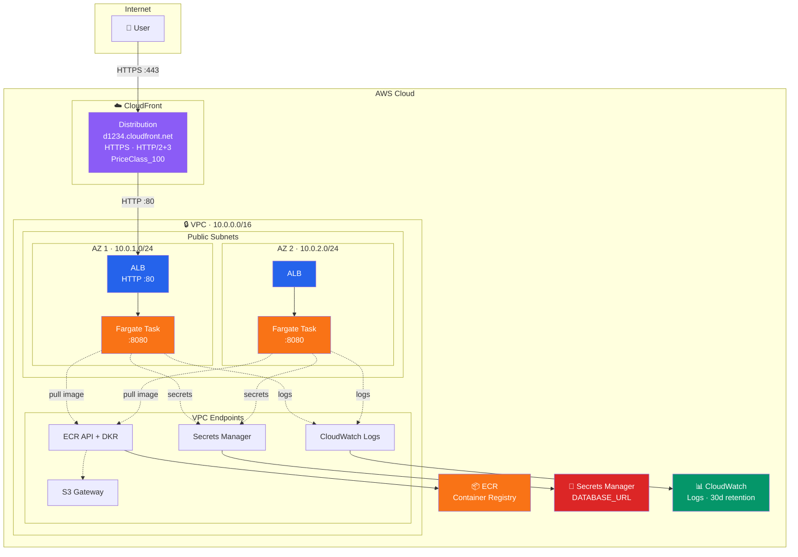
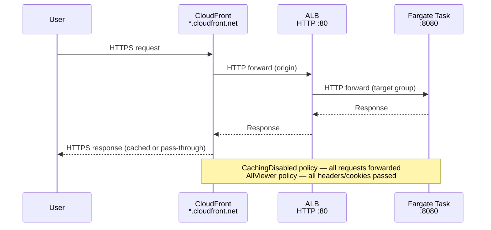
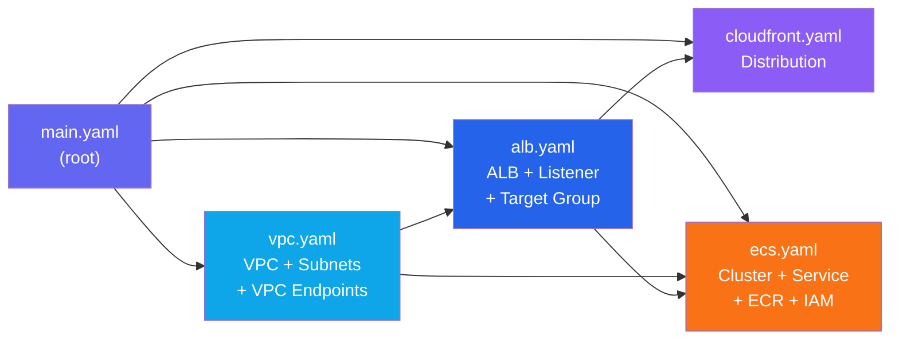

# Architecture Diagram

## Stack Overview

```mermaid
flowchart TB
    subgraph Internet
        User["👤 User"]
    end

    subgraph AWS Cloud
        subgraph CloudFront["☁️ CloudFront"]
            CF["Distribution\nd1234.cloudfront.net\nHTTPS · HTTP/2+3\nPriceClass_100"]
        end

        subgraph VPC["🔒 VPC · 10.0.0.0/16"]
            subgraph Public Subnets
                subgraph AZ1["AZ 1 · 10.0.1.0/24"]
                    ALB1["ALB\nHTTP :80"]
                    Task1["Fargate Task\n:8080"]
                end
                subgraph AZ2["AZ 2 · 10.0.2.0/24"]
                    ALB2["ALB"]
                    Task2["Fargate Task\n:8080"]
                end
            end

            subgraph VPC Endpoints
                VPCE_ECR["ECR API + DKR"]
                VPCE_S3["S3 Gateway"]
                VPCE_CW["CloudWatch Logs"]
                VPCE_SM["Secrets Manager"]
            end
        end

        ECR["📦 ECR\nContainer Registry"]
        SM["🔑 Secrets Manager\nDATABASE_URL"]
        CW["📊 CloudWatch\nLogs · 30d retention"]
    end

    User -->|"HTTPS :443"| CF
    CF -->|"HTTP :80"| ALB1
    ALB1 --> Task1
    ALB2 --> Task2
    Task1 & Task2 -.->|pull image| VPCE_ECR --> ECR
    Task1 & Task2 -.->|secrets| VPCE_SM --> SM
    Task1 & Task2 -.->|logs| VPCE_CW --> CW
    VPCE_ECR -.-> VPCE_S3

    style CF fill:#8B5CF6,color:#fff
    style ALB1 fill:#2563EB,color:#fff
    style ALB2 fill:#2563EB,color:#fff
    style Task1 fill:#F97316,color:#fff
    style Task2 fill:#F97316,color:#fff
    style ECR fill:#F97316,color:#fff
    style SM fill:#DC2626,color:#fff
    style CW fill:#059669,color:#fff
```

## Traffic Flow

```mermaid
sequenceDiagram
    participant U as User
    participant CF as CloudFront<br/>*.cloudfront.net
    participant ALB as ALB<br/>HTTP :80
    participant ECS as Fargate Task<br/>:8080

    U->>CF: HTTPS request
    CF->>ALB: HTTP forward (origin)
    ALB->>ECS: HTTP forward (target group)
    ECS-->>ALB: Response
    ALB-->>CF: Response
    CF-->>U: HTTPS response (cached or pass-through)

    Note over CF,ECS: CachingDisabled policy — all requests forwarded<br/>AllViewer policy — all headers/cookies passed
```

## Nested Stack Dependencies

```mermaid
flowchart LR
    Main["main.yaml\n(root)"] --> VPC["vpc.yaml\nVPC + Subnets\n+ VPC Endpoints"]
    Main --> ALB["alb.yaml\nALB + Listener\n+ Target Group"]
    Main --> CF["cloudfront.yaml\nDistribution"]
    Main --> ECS["ecs.yaml\nCluster + Service\n+ ECR + IAM"]

    VPC --> ALB
    VPC --> ECS
    ALB --> CF
    ALB --> ECS

    style Main fill:#6366F1,color:#fff
    style VPC fill:#0EA5E9,color:#fff
    style ALB fill:#2563EB,color:#fff
    style CF fill:#8B5CF6,color:#fff
    style ECS fill:#F97316,color:#fff
```
